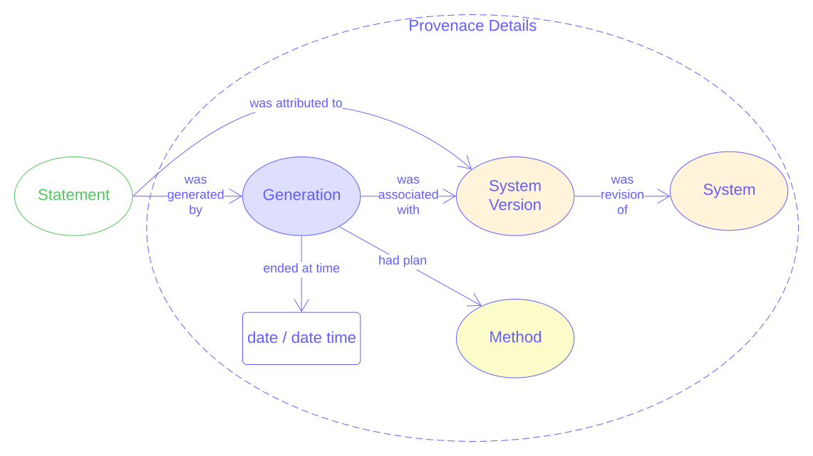

= Keywords Model
:toc: left
:table-stripes: even
:sectids:
:sectanchors:
:sectnums:

== Abstract

The model describes keywords within resources:

* their value - text or an IRI
* the known vocabularies/thesauri that they are presented it
* where they were first defined
* what tool and/or method was used to discover them
* how certain their existence in the resource is
* when they were known to be in the resource

[#fig-overview,link="images/overview.svg"]
.Overview of the Keywords Model.
image::images/overview.svg[overview figure,align="center"]

== Metadata

[frame=none, grid=none, cols="1,5"]
|===
|*<<IRI, IRI>>* | https://w3id.org/kw/
|*https://schema.org/name[Name]* | Keywords Model
|*https://www.w3.org/TR/skos-reference/#definition[Definition]* | This document is the normative specification of the Keywords Model and includes its authoritative statements of requirements, model elements and validators.
|*https://schema.org/dateCreated[Created Date]* | 2024-08-31
|*https://schema.org/dateModified[Modified Date]* | 2024-08-31
|*https://schema.org/dateIssued[Issued Date]* | 2024-08-31
|*https://schema.org/version[Version]* | 1.0
|*https://www.w3.org/TR/2012/REC-owl2-syntax-20121211/#Ontology_IRI_and_Version_IRI[Version IRI]* | https://w3id.org/kw//2.3[kw:1.0]
|https://www.w3.org/TR/skos-reference/#historyNote[*History Note*]|
*1.0* - 2024 Aug - Model created for the BODC's Semantic Analyser tool
|*https://schema.org/creator[Creator]* | https://kurrawong.ai[KurrawongAI]
|*https://schema.org/owner[Owner]* | https://kurrawong.ai[KurrawongAI]
|*https://schema.org/publisher[Publisher]* | https://kurrawong.ai[KurrawongAI]
|*https://schema.org/license[License]* | https://creativecommons.org/licenses/by/4.0/[Creative Commons Attribution 4.0 International (CC BY 4.0)]
|*https://www.w3.org/TR/vocab-dcat/#Property:resource_contact_point[Contacts]* | KurrawongAI, https://kurrawong.ai & info@kurrawong.ai

Issue tracking of this model standard is managed online at https://github.com/kurrawong/kw-model/issues
|*https://schema.org/codeRepository[Code Repository]* | https://github.com/kurrawong/kw-model
|===

== Preamble

=== Namespaces

Namespaces are used by the identifiers for model elements to ensure that they are globally unique. For example, the <<SDO, schema.org>> uses `https://schema.org/` to make IRIs such as `https://schema.org/DefinedTerm` for the class "Defined Term". Since `https://schema.org/` is globally unique (using the Internet domain name system as its base) and managed by the schema.org team, it cannot be used by others.

Namespaces are used in shortened form in documents and data by assigning them a prefix and the prefixes used in this document are given in the table below.

[frame=none, grid=none, cols="1,3,3"]
|===
|Prefix | Namespace | Description
| `:` | local graph IRI | a dummy namespace for "this graph", i.e. the system or file the object is in. Used for instance data - _does not resolve_
|`ex:` | `+http://example.com/+` | Generic examples namespace - _does not resolve_
|`owl:` | `http://www.w3.org/2002/07/owl#` | <<OWL2, Web Ontology Language ontology>> namespace
|`rdfs:` | `http://www.w3.org/2000/01/rdf-schema#` | <<RDFSSPEC, RDF Schema ontology>> namespace
|`schema:` | `https://schema.org/` | <<SDO, schema.org>> namespace
|`skos:` | `http://www.w3.org/2004/02/skos/core#` | <<SKOS, Simple Knowledge Organization System (SKOS) ontology>> namespace
|`xsd:` | `http://www.w3.org/2001/XMLSchema#` | <<XSD2, XML Schema Definitions ontology>> namespace
|===

Using the table above, the <<SKOS, SKOS>> `Concept` class would be identified as `skos:Concept`.

[NOTE]
====
A JSON-LD _context_ built from this namespaces table is available as a stand-alone resource within this model, see <<Schema>>.
====

=== Terms & Definitions

The following terms & definitions are used throughout this document.

[[BN]]
Blank Node:: A Blank Node is a node within <<RDF, RDF>> data that does not have a globally unique or even persistent identifier, instead it is a node that is identifiable only in relation to the other nodes in the RDF data in which it is recorded. Blank Nodes are used to convey things that are entirely dependent on, and meaningless without, other things, for example values for https://w3id.org/tern/ontologies/tern/Result[`tern:Result`] classes which only mean something in relation to the https://w3id.org/tern/ontologies/tern/Observation[`tern:Observation`] that generated them

[[IRI]]
IRI:: An https://en.wikipedia.org/wiki/Internationalized_Resource_Identifier[Internationalized Resource Identifier] is a web address-style URL that is used as an identifier for something. It may be for a real-world object, e.g. https://linked.data.gov.au/dataset/qldgeofeatures/AnakieProvince identifies the Queensland Geological Feature "Anakie Province" or for data only, e.g. http://www.w3.org/2004/02/skos/core#Concept which identifies the class of 'Concept' within the <<SKOS, SKOS Model>>.
+
IRIs do not have to resolve - go somewhere online when clicked - but they do have to follow all the rules for URLs, such as no spaces.

[[Class]]
Class:: Based on the mathematical notion of a _set_, within formal OWL modelling, a class is a set of objects exhibiting common properties. For example, the set of all people who are studying could be defined as being within a Student class.

[[KnowledgeGraph]]
Knowledge Graph:: A data holding that implements node-edge-node (graph) data structures. The 'knowledge' part is often taken to indicate that the graph contains refined information, not just pure, raw, data.

[[LinkedData]]
Linked Data:: A series of technologies and methodologies for the publication of data on the Internet. Uses <<RDF, RDF>> as its underlying data structure, <<OWL, OWL>> as its data model and the common mechanics of the Domain Name System (DNS) and the Hypertext Transfer Protocol (HTTP) to identify and share its data.

[[OWL]]
OWL:: The OWL 2 Web Ontology Language, informally OWL 2, is an ontology language for the Semantic Web with formally defined meaning. OWL 2 ontologies provide classes, properties, individuals, and data values and are stored as Semantic Web documents. OWL 2 ontologies can be used along with information written in RDF, and OWL 2 ontologies themselves are primarily exchanged as RDF documents. Reference: <<OWL2, OWL2>>

[[Predicate]]
Predicate:: Predicates, within formal OWL modelling, are the defined relations between objects of different classes (see <<Class, Class>>) and also between objects and simple data values such as numbers and dates. For example, if Person X "knows" Person Y, then we can use a predicate of _knows_ to relate them.
+
Frequently we use predicates already defined in existing ontologies. "knows", for example, is defined in the schema.org ontology <<SDO, SDO>> to be "The most generic bidirectional social/work relation".

[[RDF]]
RDF:: The Resource Description Framework (RDF) is a data structure for representing information on the Web. RDF is made of identified nodes linked by typed edges that form graphs. Node/edge/node associations are often called 'triples'. Reference: <<RDFSPEC, RDF>>

[[SemanticWeb]]
Semantic Web:: A vision of a machine-understandable Internet, created in the year 2000, and thought to be attainable through the use of Linked Data.

[[SPARQL]]
SPARQL:: SPARQL is a query language for RDF. SPARQL matches patterns within RDF data to extract subsets of a graph. The results of SPARQL queries can be subset graphs or data in tabular form.

=== Conventions

[discrete]
==== Figures

In this document, figures showing model elements use the following key:

[#fig-key,link="images/key.svg"]
.Key of model figure elements. `Activity`, `Entity` and `Agent` are classes from <<PROV, The Provenance Ontology>> and indicate temporal events, all manner of things and people and organisations with agency, respectively. Where `prefix:ElementID` is used, the prefix refers to entries in the <<Namespaces, Namespaces table>>.
image::images/key.svg[Key for figures,align="center"]

[discrete]
==== Code
Where examples of data are given in this document, it is according to the <<RDFSPEC, RDF>> model and serialised in the <<TURTLE, Turtle>> format is used. For example:

[source,turtle]
----
PREFIX schema: <https://schema.org/>
PREFIX skos: <http://www.w3.org/2004/02/skos/core#>

:digital-doc-x
    a schema:DigitalDocument ;
    schema:keywords
        [
            a schema:DefinedTerm ;
            schema:inDefinedTermSet
                [
                    a schema:DefinedTermSet ;
                    skos:prefLabel "CUAHSI Value Type CV" ;
                ] ;
            schema:value "Sample" ;
        ] ,
        [
            a schema:DefinedTerm ;
            schema:keywords "stratum" ;
            schema:value "Soil" ;
        ] ;
.
----

The above example data provides a simple example of a _DigitalDocument_ and several _DefinedTerm_ s (keywords) for it, one of which is indicated as being within a _DefinedTermSet_ - a vocabulary, encoded in Turtle.

If prefixes - `:`, `schema:` and `tern:` in the example above - are not declared within the example, as they are here - lines starting `PREFIX` - then they will be found in the <<Namespaces, Namespaces>> table above.

== Introduction

This model enables the description of keywords for a resource - a digital document - and keywords being within a vocabulary in qualified and nuanced ways. The reason for this is that we wish to extract keywords from igital documents using a number of methods, some of which do not produce perfectly certain results, and then we want to determine, or at least guess, what vocabulary/vocabularies the keywords come from.

So, as opposed to a direct, and simple, keyword declaration for a digital document, perhaps `:digital-doc-x schema:keywords :keyword-y` and a direct and scimple declaration of that keyword being within a vocabulary, perhaps `:keyword-y skos:inScheme :vocab-z` we use <<RDF, RDF>>'s https://patterns.dataincubator.org/book/qualified-relation.html[qualified relations] pattern to link the digital document to the keyword value via an intermediary description of the keyword `:digital-doc-x schema:keywords :refined-term-n` and then `:defined-term-m schema:value :keyword-y` and then the intermediary description of the keyword to the vocabulary `:defined-term-m schema:inDefinedTermSet :defined-term-set-n`. We also allow the keyword to be not just an IRI but also textual or an ID - some form of non-language token - since we often see keywords presented in these ways in digital documents.

This model considers the "statement" that a digital document contains/uses a keyword and the "statement" that the keyword is within a vocabulary to be potentially uncertain, or certain only to the level of skill of some system that made the statement, so it provides standard modelling of the provenance of the statements, according to <<PROV, PROV>>.

The next few subsections show this model at work in several scenarios.

=== Scenarios

==== Describing keyword extraction

If Method A, implemented by version 1.2 of System B is used to extract from Digital Document X the Keyword Y:

[source,turtle]
----
# the statement that the digital document has/uses the keyword
:digital-doc-x
    a schema:DigitalDocument ;
    schema:keywords :keyword-y ;
.

# the value of the keyword
:keyword-y
    a schema:DefinedTerm ;
    schema:value "some words" ; # could be an IRI or a token instead of words
.

# the linking of the above statement to the details of its generation
[]
    a rdf:Statement ;
    rdf:subject :digital-doc-x
    rdf:predicate schema:keywords ;
    rdf:object :keyword-y ;
    prov:wasGeneratedBy :generation-i ;
    prov:generatedAtTime "2024-08-31T14:15:16" ;
.

# details of how/when the statement was made
:generation-i
    a prov:Generation ;
    prov:wasAssociatedWith :system-b-version-1.2 ;
    prov:hasPlan :config-j ;  # not detailed further here
.

# system version details
:system-b-version-1.2
    a prov:SoftwareAgent ;
    prov:wasRevisionOf :system-b ;
    schema:version "1.2" ;
.

:system-b
    a prov:SoftwareAgent ;
    schema:name "System B";
    schema:codeRepository "https://github.com/some-org/system-b" ;
.
----

==== Describing a keyword within a vocabulary

If a described method, Method 1, determined that Keyword Y was in Vocab 2:

[source,turtle]
----
# the statement that the keyword is in the vocab
:keyword-y skos:inScheme :vocab-2 .

:keyword-y
    a schema:DefinedTerm ;
    schema:value "some words" ; # could be an IRI or a token instead of words
.

:vocab-2
    a schema:DefinedTermSet ;
    schema:name "Vocabulary 2" ;
.

# the linking of the first statement above to the details of its generation
[]
    a rdf:Statement ;
    rdf:subject :keyword-y ;
    rdf:predicate skos:inScheme ;
    rdf:object :vocab-2 ;
    prov:wasGeneratedBy :generation-k ;
    prov:generatedAtTime "2024-08-31T14:15:17" ;
.

# details of how/when the statement was made
:generation-k
    a prov:Generation ;
    prov:hasPlan :method-1 ;
.

# method details
:method-1 ;
    a prov:Plan ;
    schema:value "Details of the plan, in text..." ;  # or
    schema:url "link-to-the-plan-elsewhere" ;
.
----

If Keyword Y was in something other than a vocab, such as a `skos:Collection`, then the membership property would be different but the rest of the information the same. For a `skos:Collection`, replace `:keyword-y skos:inScheme :vocab-2` with `:vocab-2 skos:member :keyword-y`.

If Keyword Y is _defined_ by Vocab 2, then the predicate `rdfs:isDefinedBy` should be used alongside `skos:inScheme` to clearly indicate this case:

[source,turtle]
----
:keyword-y
    skos:inScheme :vocab-2 ;
    rdfs:isDefinedBy :vocab-2 ;
.
----

==== Matching a textual or token keyword to an IRI

If we wish to indicate that a textual or token keyword is within (or defined by) a vocab, we can indicate this using the `DefinedTerm` IRI of the keyword and then apply all the describtpive mechanics given in the above sections to that:

[source,turtle]
----
# they keyword "some_token", given an IRI by us
:keyword-y
    a schema:DefinedTerm ;
    schema:value "some_token" ;
.

# the statement that the keyword is in the vocab
:keyword-y skos:inScheme :vocab-2 .
----

==== Revising information about keywords within vocabularies

If we use more than one method to extract keywords or to associate keywords with vocabs, we can just "stack up" the details of these multiple method runs. Here Keyword I has been determined to be within Vocab P using Method A and within Vocab Q using Method B:

[source,turtle]
----
:keyword-i skos:inScheme :vocab-p .

:keyword-i skos:inScheme :vocab-q .

[]
    a rdf:Statement ;
    rdf:subject :keyword-i ;
    rdf:predicate skos:inScheme ;
    rdf:object :vocab-p ;
    prov:wasGeneratedBy :generation-1 ;
    prov:generatedAtTime "2024-08-31T14:15:16" ;
.

:generation-1 prov:hadPlan :method-A .

[]
    a rdf:Statement ;
    rdf:subject :keyword-i ;
    rdf:predicate skos:inScheme ;
    rdf:object :vocab-q ;
    prov:wasGeneratedBy :generation-2 ;
    prov:generatedAtTime "2024-08-31T14:15:17" ;
.

:generation-2 prov:hadPlan :method-B .
----

We can extract one or both results with SPARQL queries, for example, to find only the _latest_ in-vocab claim for Keyword I:

[sources,sparql]
----
    SELECT ?vocab
    WHERE {
        []
            rdf:subject :keyword-i ;
            rdf:predicate skos:inScheme ;
            rdf:object ?vocab ;
            prov:wasGeneratedBy ?generation ;
            prov:generatedAtTime ?time ;
        .
    }
    ORDER BY DESC(?time)
    LIMIT 1
----

The above query returns `:vocab-q`.

=== Provenance

[#fig-provenance,link="images/provenance.svg"]
.Provenance modelling in this model.

The information that this model is interested in the provenance of is:

* associations of a keyword with a digital document
* associations of a keyword with a vocabulary

Provenance modelling is applied to these pieces of information by use of https://patterns.dataincubator.org/book/reified-statement.html[reification] where an `rdf:Statement` object is used to indicate the `subject`, `predicate` and `object` of the RDF triple of the statement and any other information about it we wish to record, such as when it was made any by what system following what method.

This model uses conventional provenance modeling from the <<PROV, PROV>> Ontology for the provenance information itself, for example, the `prov:generatedAtTime` used in the previous section's examples indicates when a statement was recorded.

Note that any other statements valid according to <<PROV, PROV>> for are allowed by this model.

=== Model elements

The next section defines the elements - classes and predicates - used in this model. All these definitions are taken from existing models, in particular:

* <<SDO, schema.org>>
* <<PROV, PROV>>
* <<SKOS, SKOS>>

== Model

=== Classes

* <<schema:DigitalDocument, Digital Document>>
* <<schema:DefinedTerm, Defined Term>>
* <<schema:DefinedTermSet, Defined Term Set>>

[[schema:DigitalDocument]]
==== DigitalDocument

Defined as per https://schema.org/DigitalDocument:

An electronic file or document.

_Use this class to represent the thing that a keyword is from/in /about, such as a dataset's metadata record, or a data file._

[source, turtle]
----
:digital-doc-x
    a schema:DigitalDocument ;
    schema:keywords [
        a schema:DefinedTerm ;
        schema:value "structured:token:Y" ;
    ] ;
.
----

[[schema:DefinedTerm]]
==== DefinedTerm

Defined as per https://schema.org/DefinedTerm:

A word, name, acronym, phrase, etc. with a formal definition.

_Use this class to represent a keyword. If the keyword is not a Linked Data <<IRI, IRI>>, then use this class with a <<BN, Blank Node>>. Use the predicate <<schema:value, value>> to indicate a textual or token value for the keyword._

Example: see the example for <<schema:DigitalDocument, Digital Document>>.

[[schema:DefinedTermSet]]
==== DefinedTermSet

Defined as per https://schema.org/DefinedTermSet:

A set of defined terms, for example a set of categories or a classification scheme, a glossary, dictionary or enumeration.

_Use this class to represent a vocabulary ( a `skos:ConceptScheme`) or a Collection (`skos:Collection`) that contains and/or defines for the first time, a keyword. Link keywords to a Defined Term Set with the predicate <<schema:inDefinedTermSet, in Defined Term Set>>._

Example:

[source, turtle]
----
:keyword-m
    a schema:DefinedTerm ;
.

:keyword-z schema:inDefinedTermSet :dts-n

:dts-n
    a schema:inDefinedTermSet
    schema:name "The NNN Vocabulary" ;
    schema:url "http://somewhere.com/thing/vocan/n" ;
.
----

=== Predicates

* <<schema:keywords, keywords>>
* <<schema:inDefinedTermSet, in Defined Term Set>>
* <<schema:name, name>>
* <<schema:url, url>>
* <<schema:value, value>>

[[schema:keywords]]
==== keywords

Defined as per https://schema.org/keywords:

Keywords or tags used to describe some item.

_Use this predicate to indicate IRI, text or token keywords for a <<schema:DigitalDocument, Digital Document>>._

Example: see the example for <<schema:DigitalDocument, Digital Document>>.

[[schema:inDefinedTermSet]]
==== in Defined Term Set

Defined as per https://schema.org/inDefinedTermSet:

A DefinedTermSet that contains this term.

_Use this predicate to indicate IRI, text or token keywords for a <<schema:DigitalDocument, Digital Document>>._

Example: see the example for <<schema:DefinedTermSet, Defined Term Set>>

[[schema:name]]
==== name

Defined as per https://schema.org/name:

The name of the item.

_Use this predicate to indicate the name of a <<schema:DefinedTermSet, Defined Term Set>> or anything else that needs to have a name, title or label applied to it._

Example: See the example for <<schema:DefinedTermSet, Defined Term Set>>.

[[schema:url]]
==== url

Defined as per https://schema.org/url:

URL of the item.

_Use this predicate to indicate the URL of things which don't have IRIs, for example the URL of a online but non-Semantic Web form of a vocabulary._

Example: See the example for <<schema:DefinedTermSet, Defined Term Set>>.

[[schema:value]]
==== value

Defined as per https://schema.org/value:

The value of a QuantitativeValue or property value node.

_Use this predicate to indicate the value of a non-IRI keyword: it's textual or token._

Example: see the example for <<schema:DigitalDocument, Digital Document>>.

=== Axioms

None defined.

== Schema

The schema for this model - the machine-readable form of it - is an <<OWL, OWL>> document, in the <<TURTLE, Turtle>> RDF format, online at:

* https://w3id.org/kw/.ttl

This document can be downloaded from the link above and used to describe the elements of this model with RDF graphs.

A JSON-LD Context Document for this model is available online at:

* https://w3id.org/kw/context.json

== Validation

The validator for this model - the machine-readable and executable form of business rules constraining its use - is a is an <<SHACL, SHACL>> document, in the <<TURTLE, Turtle>> RDF format, online at:

* https://w3id.org/kw/validator

THis document can be used with SHACL tools, such as https://github.com/RDFLib/pySHACL[pySHACL] to automatically validate data claiming conformance to this model.

== Bibliography

[[DCAT]]
DCAT:: World Wide Web Consortium, _Data Catalog Vocabulary (DCAT) - Version 2_, W3C Recommendation (04 February 2020). https://www.w3.org/TR/vocab-dcat/

[[OWL2]]
OWL2:: World Wide Web Consortium, _OWL 2 Web Ontology Language Document Overview (Second Edition)_, W3C Recommendation (11 December 2012). https://www.w3.org/TR/owl2-overview/

[[PROF]]
PROF:: World Wide Web Consortium, _The Profiles Vocabulary_, W3C Working Group Note (18 December 2019). https://www.w3.org/TR/dx-prof/

[[PROV]]
PROV:: World Wide Web Consortium, _PROV-O: The PROV Ontology_, W3C Recommendation (30 February 2013). https://www.w3.org/TR/prov-o/

[[RDFSPEC]]
RDFSPEC:: World Wide Web Consortium, _RDF 1.1 Concepts and Abstract Syntax_, W3C Recommendation (25 February 2014). https://www.w3.org/TR/rdf11-concepts/

[[RDFSSPEC]]
RDFSSPEC:: World Wide Web Consortium, _RDF Schema 1.1_, W3C Recommendation (25 February 2014). https://www.w3.org/TR/rdf11-schema/

[[SDO]]
schema:: schema.org Consortium, _schema.org_, OWL vocabulary (26 June 2023). https://schema.org/

[[SHACL]]
SHACL:: World Wide Web Consortium, _Shapes Constraint Language (SHACL)_, W3C Recommendation (20 July 2017). https://www.w3.org/TR/shacl/

[[SKOS]]
SKOS:: World Wide Web Consortium, _SKOS Simple Knowledge Organization System Reference_, W3C Recommendation (18 August 2009). https://www.w3.org/TR/skos-reference/

[[TIME]]
TIME:: World Wide Web Consortium, _Time Ontology in OWL_, W3C Candidate Recommendation (26 March 2020). https://www.w3.org/TR/owl-time/

[[TURTLE]]
TURTLE:: World Wide Web Consortium, _RDF 1.1 Turtle - Terse RDF Triple Language_, W3C Recommendation (25 February 2014). https://www.w3.org/TR/turtle/

[[XSD2]]
XSD2:: World Wide Web Consortium, _XML Schema Part 2: Datatypes (Second Edition)_, W3C Recommendation (28 October 2004). https://www.w3.org/TR/xmlschema-2/
