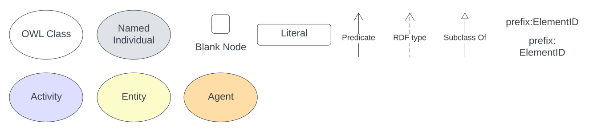

= Keywords Model
:toc: left
:table-stripes: even
:sectids:
:sectanchors:
:sectnums:

== Abstract

The model describes keywords within resources:

* their value - text or an IRI
* the known vocabularies/thesauri that they are presented it
* where they were first defined
* what tool and/or method was used to discover them
* how certain their existence in the resource is
* when they were known to be in the resource

== Metadata

[frame=none, grid=none, cols="1,5"]
|===
|*<<IRI, IRI>>* | https://w3id.org/kw/
|*https://schema.org/name[Name]* | Keywords Model
|*https://www.w3.org/TR/skos-reference/#definition[Definition]* | This document is the normative specification of the Keywords Model and includes its authoritative statements of requirements, model elements and validators.
|*https://schema.org/dateCreated[Created Date]* | 2024-08-31
|*https://schema.org/dateModified[Modified Date]* | 2024-08-31
|*https://schema.org/dateIssued[Issued Date]* | 2024-08-31
|*https://schema.org/version[Version]* | 1.0
|*https://www.w3.org/TR/2012/REC-owl2-syntax-20121211/#Ontology_IRI_and_Version_IRI[Version IRI]* | https://w3id.org/kw//2.3[kw:1.0]
|https://www.w3.org/TR/skos-reference/#historyNote[*History Note*]|
*1.0* - 2024 Aug - Model created for the BODC's Semantic Analyser tool
|*https://schema.org/creator[Creator]* | https://kurrawong.ai[KurrawongAI]
|*https://schema.org/owner[Owner]* | https://kurrawong.ai[KurrawongAI]
|*https://schema.org/publisher[Publisher]* | https://kurrawong.ai[KurrawongAI]
|*https://schema.org/license[License]* | https://creativecommons.org/licenses/by/4.0/[Creative Commons Attribution 4.0 International (CC BY 4.0)]
|*https://www.w3.org/TR/vocab-dcat/#Property:resource_contact_point[Contacts]* | KurrawongAI, https://kurrawong.ai & info@kurrawong.ai

Issue tracking of this model standard is managed online at https://github.com/kurrawong/kw-model/issues
|*https://schema.org/codeRepository[Code Repository]* | https://github.com/kurrawong/kw-model
|===

== Preamble

=== Namespaces

Namespaces are used by the identifiers for model elements to ensure that they are globally unique. For example, the <<SDO, schema.org>> uses `https://schema.org/` to make IRIs such as `https://schema.org/DefinedTerm` for the class "Defined Term". Since `https://schema.org/` is globally unique (using the Internet domain name system as its base) and managed by the schema.org team, it cannot be used by others.

Namespaces are used in shortened form in documents and data by assigning them a prefix and the prefixes used in this document are given in the table below.

[frame=none, grid=none, cols="1,3,3"]
|===
|Prefix | Namespace | Description
|`dcat:`| `http://www.w3.org/ns/dcat#` | <<DCAT, Data Catalogue Vocabulary>> namespace
|`ex:` | `+http://example.com/+` | Generic examples namespace - _does not resolve_
|`owl:` | `http://www.w3.org/2002/07/owl#` | <<OWL2, Web Ontology Language ontology>> namespace
|`rdfs:` | `http://www.w3.org/2000/01/rdf-schema#` | <<RDFSSPEC, RDF Schema ontology>> namespace
|`schema:` | `https://schema.org/` | <<SDO, schema.org>> namespace
|`skos:` | `http://www.w3.org/2004/02/skos/core#` | <<SKOS, Simple Knowledge Organization System (SKOS) ontology>> namespace
|`time:` | `http://www.w3.org/2006/time#` | <<TIME, Time Ontology>> in OWL namespace
|`xsd:` | `http://www.w3.org/2001/XMLSchema#` | <<XSD2, XML Schema Definitions ontology>> namespace
|===

Using the table above, the <<SKOS, SKOS>> `Concept` class would be identified as `skos:Concept`.

[NOTE]
====
A JSON-LD _context_ built from this namespaces table is available as a stand-alone resource within this model, see <<Schema>>.
====

=== Terms & Definitions

The following terms & definitions are used throughout this document.

[[BN]]
Blank Node:: A Blank Node is a node within <<RDF, RDF>> data that does not have a globally unique or even persistent identifier, instead it is a node that is identifiable only in relation to the other nodes in the RDF data in which it is recorded. Blank Nodes are used to convey things that are entirely dependent on, and meaningless without, other things, for example values for https://linkeddata.tern.org.au/viewers/tern-ontology?resource=https://w3id.org/tern/ontologies/tern/Result[`tern:Result`] classes which only mean something in relation to the https://linkeddata.tern.org.au/viewers/tern-ontology?resource=https://w3id.org/tern/ontologies/tern/Observation[`tern:Observation`] that generated them

[[IRI]]
IRI:: An https://en.wikipedia.org/wiki/Internationalized_Resource_Identifier[Internationalized Resource Identifier] is a web address-style URL that is used as an identifier for something. It may be for a real-world object, e.g. https://linked.data.gov.au/dataset/qldgeofeatures/AnakieProvince identifies the Queensland Geological Feature "Anakie Province" or for data only, e.g. http://www.w3.org/2004/02/skos/core#Concept which identifies the class of 'Concept' within the <<SKOS, SKOS Model>>.
+
IRIs do not have to resolve - go somewhere online when clicked - but they do have to follow all the rules for URLs, such as no spaces.

[[Class]]
Class:: Based on the mathematical notion of a _set_, within formal OWL modelling, a class is a set of objects exhibiting common properties. For example, the set of all people who are studying could be defined as being within a Student class.

[[KnowledgeGraph]]
Knowledge Graph:: A data holding that implements node-edge-node (graph) data structures. The 'knowledge' part is often taken to indicate that the graph contains refined information, not just pure, raw, data.

[[LinkedData]]
Linked Data:: A series of technologies and methodologies for the publication of data on the Internet. Uses <<RDF, RDF>> as its underlying data structure, <<OWL, OWL>> as its data model and the common mechanics of the Domain Name System (DNS) and the Hypertext Transfer Protocol (HTTP) to identify and share its data.

[[OWL]]
OWL:: The OWL 2 Web Ontology Language, informally OWL 2, is an ontology language for the Semantic Web with formally defined meaning. OWL 2 ontologies provide classes, properties, individuals, and data values and are stored as Semantic Web documents. OWL 2 ontologies can be used along with information written in RDF, and OWL 2 ontologies themselves are primarily exchanged as RDF documents. Reference: <<OWL2, OWL2>>

[[Predicate]]
Predicate:: Predicates, within formal OWL modelling, are the defined relations between objects of different classes (see <<Class, Class>>) and also between objects and simple data values such as numbers and dates. For example, if Person X "knows" Person Y, then we can use a predicate of _knows_ to relate them.
+
Frequently we use predicates already defined in existing ontologies. "knows", for example, is defined in the schema.org ontology <<SDO, SDO>> to be "The most generic bidirectional social/work relation".

[[RDF]]
RDF:: The Resource Description Framework (RDF) is a data structure for representing information on the Web. RDF is made of identified nodes linked by typed edges that form graphs. Node/edge/node associations are often called 'triples'. Reference: <<RDFSPEC, RDF>>

[[SemanticWeb]]
Semantic Web:: A vision of a machine-understandable Internet, created in the year 2000, and thought to be attainable through the use of Linked Data.

[[SPARQL]]
SPARQL:: SPARQL is a query language for RDF. SPARQL matches patterns within RDF data to extract subsets of a graph. The results of SPARQL queries can be subset graphs or data in tabular form.

=== Conventions

[discrete]
==== Figures

In this document, figures showing model elements use the following key:

[#key,link="images/key.svg"]
.Key of model figure elements. `Activity`, `Entity` and `Agent` are classes from <<PROV, The Provenance Ontology>> and indicate temporal events, all manner of things and people and organisations with agency, respectively. Where `prefix:ElementID` is used, the prefix refers to entries in the <<Namespaces, Namespaces table>>.

[discrete]
==== Code
Where examples of data are given in this document, it is according to the <<RDFSPEC, RDF>> model and serialised in the <<TURTLE, Turtle>> format is used. For example:

[source,turtle]
----
PREFIX schema: <https://schema.org/>
PREFIX skos: <http://www.w3.org/2004/02/skos/core#>

ex:396cbad0-1ce8-4401-b193-861118414865
    a schema:DigitalDocument ;
    schema:keywords
        [
            a schema:DefinedTerm ;
            schema:inDefinedTermSet
                [
                    a schema:DefinedTermSet ;
                    skos:prefLabel "CUAHSI Value Type CV" ;
                ] ;
            schema:value "Sample" ;
        ] ,
        [
            a schema:DefinedTerm ;
            schema:keywords "stratum" ;
            schema:value "Soil" ;
        ] ;
.
----

The above example data provides a simple example of a _DigitalDocument_ and several _DefinedTerm_s (keywords) for it, one of which is indicated as being within a _DefinedTermSet_ - a vocabulary, encoded in Turtle.

If prefixes - `ex:`, `schema:` and `tern:` in the example above - are not declared within the example, as they are here - lines starting `PREFIX` - then they will be found in the <<Namespaces, Namespaces>> table above.

== Introduction

Start...

== Model

== Schema

== Validation

== Bibliography

[[DCAT]]
DCAT:: World Wide Web Consortium, _Data Catalog Vocabulary (DCAT) - Version 2_, W3C Recommendation (04 February 2020). https://www.w3.org/TR/vocab-dcat/

[[OWL2]]
OWL2:: World Wide Web Consortium, _OWL 2 Web Ontology Language Document Overview (Second Edition)_, W3C Recommendation (11 December 2012). https://www.w3.org/TR/owl2-overview/

[[PROF]]
PROF:: World Wide Web Consortium, _The Profiles Vocabulary_, W3C Working Group Note (18 December 2019). https://www.w3.org/TR/dx-prof/

[[PROV]]
PROV:: World Wide Web Consortium, _PROV-O: The PROV Ontology_, W3C Recommendation (30 February 2013). https://www.w3.org/TR/prov-o/

[[RDFSPEC]]
RDFSPEC:: World Wide Web Consortium, _RDF 1.1 Concepts and Abstract Syntax_, W3C Recommendation (25 February 2014). https://www.w3.org/TR/rdf11-concepts/

[[RDFSSPEC]]
RDFSSPEC:: World Wide Web Consortium, _RDF Schema 1.1_, W3C Recommendation (25 February 2014). https://www.w3.org/TR/rdf11-schema/

[[SDO]]
schema:: schema.org Consortium, _schema.org_, OWL vocabulary (26 June 2023). https://schema.org/

[[SHACL]]
SHACL:: World Wide Web Consortium, _Shapes Constraint Language (SHACL)_, W3C Recommendation (20 July 2017). https://www.w3.org/TR/shacl/

[[SKOS]]
SKOS:: World Wide Web Consortium, _SKOS Simple Knowledge Organization System Reference_, W3C Recommendation (18 August 2009). https://www.w3.org/TR/skos-reference/

[[TIME]]
TIME:: World Wide Web Consortium, _Time Ontology in OWL_, W3C Candidate Recommendation (26 March 2020). https://www.w3.org/TR/owl-time/

[[TURTLE]]
TURTLE:: World Wide Web Consortium, _RDF 1.1 Turtle - Terse RDF Triple Language_, W3C Recommendation (25 February 2014). https://www.w3.org/TR/turtle/

[[XSD2]]
XSD2:: World Wide Web Consortium, _XML Schema Part 2: Datatypes (Second Edition)_, W3C Recommendation (28 October 2004). https://www.w3.org/TR/xmlschema-2/
